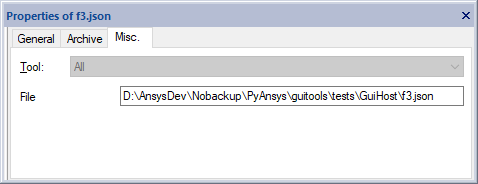
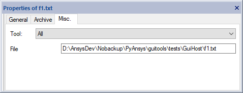
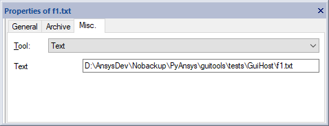
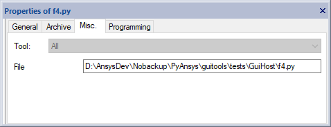
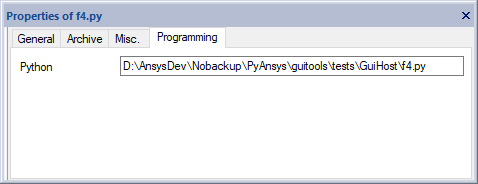

# GuiHost tests
This GuiHost test package allows testing manually the usage of the component.
It declares client pages.

## Setup
* Register the package to SCADE as detailed in
  [Install in user mode](<https://guitools.scade.docs.pyansys.com/version/dev/contributing.html#install-in-user-mode>).
* Install the `guihost-ut` test package so that it is accessible in a SCADE environment.

  You must use a Python interpreter compatible with your version of SCADE.

  ```cmd
  python -m pip install --user .
  ```

## Test procedure
### Initialization
* Run Ansys SCADE
* Verify the `Messages` output tab displays the following text:

  ```
  Loading GUI Host 2.0.dev0
  ```
* Open ``Project.vsw``

### Clients
* Select `f3.json`.
  * Verify the `Misc.` tab is available in the property page and displays as follows:

    

  * Verify the `Programming` tab is not present.
* Select `f1.txt`.
  * Verify the `Misc.` tab is available in the property page and displays as follows:

    

  * Verify the `Programming` tab is not present.
  * Select `Text` in the combo box and verify the page is updated as follows:

    

* Select `f4.py`.
  * Verify the `Misc.` tab is available in the property page and displays as follows:

    

  * Verify the `Programming` tab is available in the property page and displays as follows:

    

## Clean
You may uninstall the package once the tests are completed:

* Unregister the package from SCADE as detailed in
  [Uninstall](<https://guitools.scade.docs.pyansys.com/version/dev/contributing.html#uninstall>).
* Uninstall the test extension:

  ```cmd
  python -m pip uninstall guihost-ut
  ```
