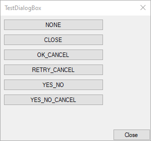
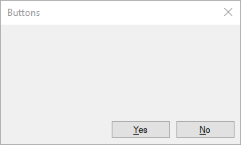
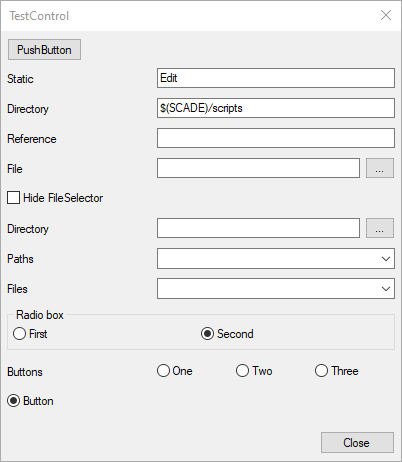

# Integration tests
This SCADE Studio Custom Extension allows testing manually the usage of the library.
It declares dialogs, property and settings pages.

## Setup
* Register the package to SCADE as detailed in
  [Install in user mode](<https://guitools.scade.docs.pyansys.com/version/dev/contributing.html#install-in-user-mode>).
* Register the test extension to SCADE: Run the PowerShell script
  [`reggitext.ps1`](reggitext.ps1), from its directory.
  A right click *Run with PowerShell* in the explorer window is easier.

  This commands copies `guitools_ut_ext.srg` to `%APPDATA%\SCADE\Customize` and updates it according to your working directory.

## Test procedure
### Initialization
* Run Ansys SCADE
* Verify the `Messages` output tab displays the following text:

  ```
  Loading integration tests for Ansys SCADE GUI Tools <version>.
  Integration tests for Ansys SCADE GUI Tools <version> loaded.
  ```
* Open ``Project.vsw``

### Debug (optional)
* Launch the command `Tools/Test GUI Tools/Attach to Debugger` to connect to a Python Debugger. Refer to [Debug](<https://guitools.scade.docs.pyansys.com/version/dev/contributing.html#debug>) for details.

### Dialog Box
* Launch the command `Tools/Test GUI Tools/DialogBox...` and verify the following dialog pops-up:

  

* For each button on the left:

  * Verify it opens a new dialog with the corresponding buttons.
    Each button must close this second dialog without raising an exception.

    The dialog hereafter corresponds to the button ``YES_NO``:

      

  * Use the ``ESC`` key to close a dialog without button.

* Close the test dialog with the ``Close`` button.

### Control
* Launch the command `Tools/Test GUI Tools/Control...` and verify the following dialog pops-up:

  

* Click on the ``...`` button and select ``grf.py``.
* Verify the result is set to the absolute path of ``grf.py``.
* Move the content of Directory to Reference
* Click on the ``...`` button and select ``grf.py``.
* Verify the result is set to the absolute path of ``grf.py``.
* Click the check box ``Hide FileSelector`` a couple of time,
  and verify the line above is entirely hidden or displayed.
* Close the test dialog with the ``Close`` button.

## Clean
You may uninstall the package once the tests are completed:

* Unregister the package from SCADE as detailed in
  [Uninstall](<https://guitools.scade.docs.pyansys.com/version/dev/contributing.html#uninstall>).
* Unregister the test extension:

  ```cmd
  del %APPDATA%\SCADE\Customize\guitools_ut_ext.srg
  ```
